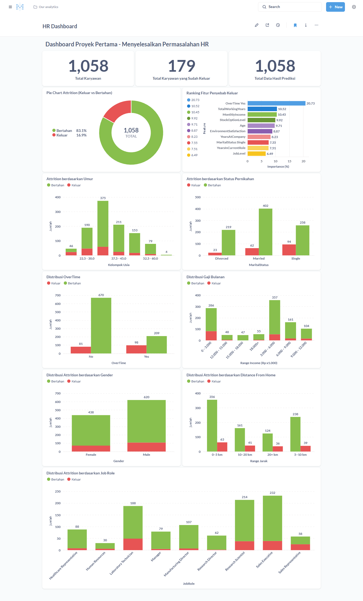
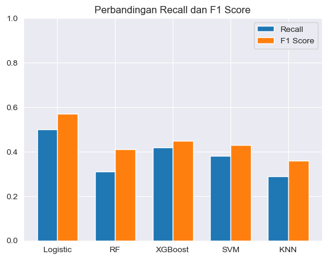
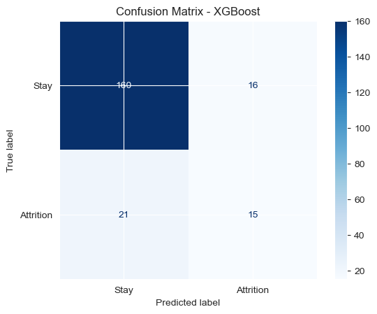
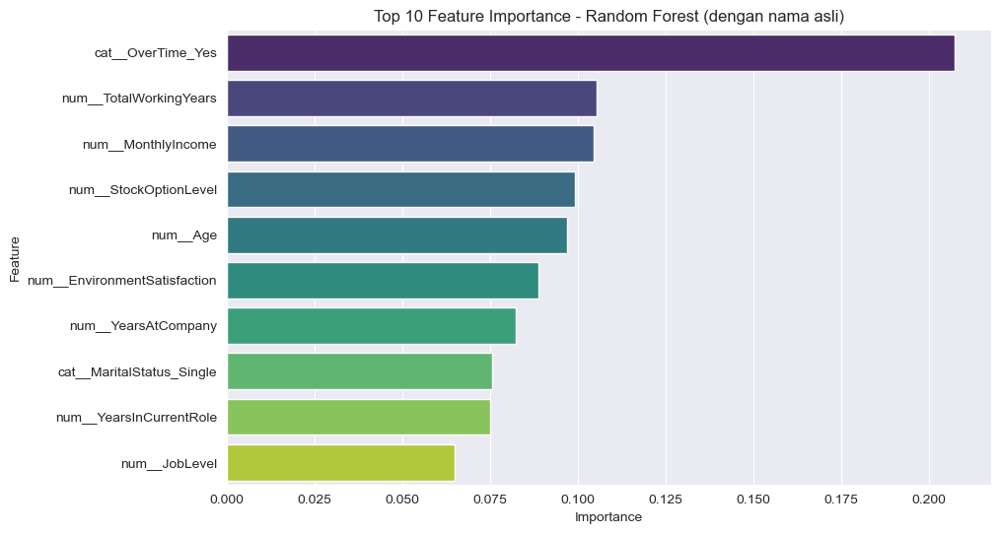

# Submission Pertama: Menyelesaikan Permasalahan Human Resources
- **Nama:** Muhammad Dila
- **Email:** muhammaddila.all@gmail.com
- **ID Dicoding:** muhdila

---

# Project Overview

Tingginya angka karyawan yang keluar (attrition) merupakan salah satu tantangan serius yang dihadapi oleh departemen Human Resources (HR), terutama pada perusahaan besar seperti **Jaya Jaya Maju** yang memiliki lebih dari 1000 karyawan di seluruh Indonesia. Dalam beberapa tahun terakhir, perusahaan ini mencatat attrition rate yang cukup tinggi, melebihi **10%**, yang dikhawatirkan dapat mengganggu stabilitas organisasi dan produktivitas tim.

Fenomena ini memunculkan pertanyaan penting: **apa saja faktor yang membuat karyawan memutuskan untuk keluar dari perusahaan?**

**Mengapa masalah ini penting untuk diselesaikan?**

- Tingginya attrition menyebabkan biaya besar dalam proses rekrutmen, pelatihan ulang, dan adaptasi karyawan baru.
- Menurunnya loyalitas dan motivasi karyawan dapat berdampak pada performa tim secara keseluruhan.
- Dengan memahami pola dan faktor yang memengaruhi keputusan keluar, perusahaan bisa mengambil tindakan preventif untuk mempertahankan talenta terbaik.

**Bagaimana cara menyelesaikannya?**

- Dengan melakukan eksplorasi dan analisis menyeluruh terhadap data karyawan.
- Mengembangkan model prediksi **attrition** menggunakan algoritma machine learning seperti Logistic Regression, Random Forest, dan XGBoost (opsional).
- Membangun **business dashboard interaktif** menggunakan **Metabase** untuk membantu manajer HR:
  - Memantau distribusi dan karakteristik karyawan.
  - Menemukan faktor-faktor penting penyebab attrition.
  - Mengevaluasi potensi risiko karyawan keluar berdasarkan profil mereka.

Dataset yang digunakan merupakan data fiktif dari perusahaan Jaya Jaya Maju dan dapat diakses melalui tautan berikut: [Dataset](https://github.com/dicodingacademy/dicoding_dataset/blob/main/employee/employee_data.csv)

---

# Business Understanding

## Latar Belakang Bisnis

Jaya Jaya Maju adalah perusahaan multinasional yang telah berdiri sejak tahun 2000 dan memiliki lebih dari 1.000 karyawan. Walaupun perusahaan ini cukup besar, mereka menghadapi tantangan serius dalam hal manajemen karyawan, khususnya tingginya tingkat keluar karyawan (attrition) yang mencapai lebih dari 10%. Tingginya angka attrition berdampak langsung terhadap hilangnya talenta, menurunnya produktivitas, serta meningkatnya beban kerja bagi karyawan yang bertahan. 

Manajer departemen HR membutuhkan dukungan berbasis data untuk memahami faktor-faktor yang mendorong keputusan karyawan keluar, dan memerlukan sistem yang dapat memantau tren tersebut secara real-time.

---

## Permasalahan Bisnis

- Tingginya angka karyawan keluar tanpa pemahaman menyeluruh mengenai penyebab utamanya.
- HR kesulitan menganalisis data karyawan dalam jumlah besar secara manual.
- Belum tersedia sistem monitoring berbasis visualisasi data untuk memantau faktor penyebab attrition.
- Tidak adanya sistem prediktif untuk mengidentifikasi karyawan berisiko keluar.

---

## Cakupan Proyek

Proyek ini mencakup:

- Pembersihan dan eksplorasi data karyawan (EDA).
- Analisis faktor-faktor yang memengaruhi attrition (usia, lembur, status pernikahan, dll).
- Pemilihan fitur penting menggunakan korelasi dan feature selection (RFE).
- Pembangunan model prediktif menggunakan 5 algoritma: Logistic Regression, Random Forest, SVM, XGBoost, dan KNN.
- Evaluasi model menggunakan metrik akurasi, recall, dan F1-score.
- Pembuatan business dashboard interaktif di Metabase untuk memvisualisasikan hasil analisis dan insight model.

---

## Persiapan

### **Sumber Data**
Dataset yang digunakan dalam proyek ini berasal dari **[Jaya Jaya Maju Employee Dataset](https://github.com/dicodingacademy/dicoding_dataset/tree/main/employee)**. Dataset ini disediakan secara resmi oleh Dicoding sebagai bagian dari studi kasus proyek pertama.

---

### **Setup Lingkungan (Environment Setup)**

Agar seluruh proses analisis, prediksi, dan visualisasi berjalan dengan lancar, berikut adalah langkah-langkah setup yang direkomendasikan:

---

#### 1. **Menjalankan `notebook.ipynb`**
- Pastikan seluruh **library dan dependensi** yang diperlukan telah terinstal (cek file `requirements.txt`).
- Notebook ini dapat dibuka di Google Colab, JupyterLab, atau IDE lokal seperti VSCode.
- Jalankan sel secara berurutan untuk melakukan data exploration, preprocessing, feature selection, modeling, dan evaluasi.

---

#### 2. **Menjalankan `prediction.py`**
- Script ini berfungsi untuk melakukan prediksi pada dataset baru.
- Bisa dijalankan langsung dari terminal atau IDE, pastikan dependensi sudah sesuai dengan `requirements.txt`.
- Edit baris berikut untuk menyesuaikan input:
  ```python
  sample = pd.read_csv('dataset/sample_data.csv')  # Ganti path sesuai file yang ingin diprediksi


---

#### **3. Menjalankan Dashboard**
Untuk melihat **dashboard** secara langsung, Anda dapat menggunakan **Metabase** dengan bantuan **Docker**. Pastikan **Docker** telah terpasang di sistem Anda.

**Langkah-langkah untuk menjalankan Metabase menggunakan Docker**:
1. **Tarik (pull) image Metabase dari Docker Hub** dengan perintah:
   ```bash
   docker pull metabase/metabase:latest
   ```

2. **Jalankan container Metabase** dengan perintah:
   ```bash
   docker run -p 3000:3000 --name metabase metabase/metabase
   ```

3. **Login ke Metabase** menggunakan kredensial berikut:
   - **email**: `root@mail.com`
   - **Password**: `root123`
   - atau
   - **Username**: `muhammaddila.all@gmail.com`
   - **email**: `313200863MuhDila`

Dengan mengikuti langkah-langkah ini, Anda dapat memulai **analisis data** dan **dashboard**, serta melihat hasil visualisasi langsung di **Metabase**.

---

# Business Dashboard

Business dashboard ini dibuat menggunakan **Metabase** untuk memberikan visualisasi interaktif yang membantu departemen HR dalam memahami pola dan faktor yang mempengaruhi tingginya tingkat keluar karyawan (attrition) di perusahaan **Jaya Jaya Maju**.

## Tujuan Dashboard
Dashboard ini berfungsi untuk:
- Menampilkan komposisi karyawan yang keluar dan bertahan.
- Memvisualisasikan faktor-faktor utama penyebab attrition berdasarkan hasil model machine learning.
- Menyajikan distribusi attrition berdasarkan kategori penting seperti umur, gender, status pernikahan, job role, jarak rumah, gaji bulanan, dan overtime.

## Tampilan Dashboard



## Fitur-Fitur Dashboard:
- **Pie Chart Attrition**: Menunjukkan persentase karyawan keluar (16.9%) vs bertahan (83.1%).
- **Top Faktor Penyebab Keluar**: Seperti lembur (OverTime), total tahun pengalaman kerja, dan pendapatan bulanan.
- **Distribusi Attrition** berdasarkan:
  - Umur: Karyawan usia 25–35 tahun paling banyak keluar.
  - Gender: Laki-laki lebih dominan secara populasi dan attrition.
  - Status Pernikahan: Single memiliki tingkat attrition tertinggi.
  - Job Role: Sales Representative dan Lab Technician memiliki tingkat keluar paling tinggi.
  - Gaji: Income rendah berkorelasi dengan keluar.
  - Jarak: Karyawan dengan jarak rumah >10 km lebih berisiko keluar.
  - OverTime: Karyawan lembur jauh lebih rentan keluar.

## Akses Dashboard
Dashboard ini dapat diakses melalui Metabase secara lokal:

- **Email**: `muhammaddila.all@gmail.com`
- **Password**: `313200863MuhDila!`
- **URL lokal**: [http://localhost:3000](http://localhost:3000)

Dashboard ini juga telah diekspor dalam bentuk file database `.mv.db` dan disertakan dalam submission.

# Modeling

Setelah proses *data preparation* selesai, lima model machine learning dilatih menggunakan data yang telah diseimbangkan dengan SMOTE dan difokuskan pada 10 fitur terbaik hasil seleksi RFE. Pendekatan ini memastikan bahwa semua model menerima input yang seragam dan optimal untuk prediksi attrition karyawan.

---

## Model yang Digunakan

1. **Logistic Regression**
   - Model linier yang digunakan sebagai baseline.
   - Konfigurasi: `class_weight='balanced'`.
   - **Keunggulan:** Interpretasi sederhana, cepat, cocok untuk baseline model.

2. **Random Forest**
   - Model ensemble berbasis decision tree.
   - Konfigurasi: `class_weight='balanced'`, estimators default.
   - **Keunggulan:** Menangani fitur non-linier, relatif tahan terhadap overfitting.

3. **XGBoost**
   - Model boosting yang sangat akurat dan efisien.
   - Konfigurasi: `scale_pos_weight` untuk menangani kelas minoritas, serta `subsample` dan `colsample_bytree` untuk regularisasi.
   - **Keunggulan:** Menangkap pola kompleks, kustomisasi parameter yang fleksibel.

4. **Support Vector Machine (SVM)**
   - Model margin-based menggunakan kernel RBF.
   - Memerlukan data yang sudah diskalakan.
   - **Keunggulan:** Efektif pada dimensi tinggi, mampu memisahkan kelas dengan margin maksimum.

5. **K-Nearest Neighbors (KNN)**
   - Model instance-based yang mengklasifikasi berdasarkan kedekatan.
   - Konfigurasi: `n_neighbors=5`, `weights='distance'`.
   - **Keunggulan:** Tidak memerlukan proses pelatihan eksplisit, simpel.

---

## Tujuan Eksperimen Multi-Model

Penggunaan berbagai pendekatan modeling ini bertujuan untuk:

- **Membandingkan** performa pendekatan linier, pohon keputusan, boosting, margin-based, dan instance-based.
- **Menemukan** model paling andal dalam memprediksi attrition berdasarkan data HR.
- **Menguji** keefektifan model terhadap masalah ketidakseimbangan kelas (imbalanced classification).

Evaluasi performa dilakukan dengan fokus pada kelas target "Attrition", menggunakan metrik:

- **Recall**: Seberapa baik model mengenali karyawan yang keluar.
- **F1-Score**: Keseimbangan antara precision dan recall.
- **Accuracy**: Proporsi prediksi yang tepat dari keseluruhan.

Metrik ini memberikan gambaran menyeluruh tentang performa model terutama dalam konteks prediksi attrition karyawan, yang menjadi tantangan utama bagi perusahaan.

---

# Model Evaluation & Insight

Evaluasi dilakukan untuk membandingkan performa lima model klasifikasi dalam mendeteksi karyawan yang akan mengalami attrition (keluar dari perusahaan). Fokus utama evaluasi adalah pada **kelas Attrition**, karena ini merupakan fokus utama analisis.

---

## Tabel Performa Model (Kelas: Attrition)

| Model                  | Accuracy | Recall | F1-Score |
| ---------------------- | -------- | ------ | -------- |
| Logistic Regression    | 0.7123   | 0.72   | 0.46     |
| Random Forest          | 0.8019   | 0.33   | 0.36     |
| XGBoost                | 0.8255   | 0.42   | 0.45     |
| Support Vector Machine | 0.7170   | 0.61   | 0.42     |
| K-Nearest Neighbors    | 0.6415   | 0.50   | 0.32     |

---

## Grafik Perbandingan Recall & F1 Score



**Insight:**
- **Logistic Regression** memiliki nilai recall tertinggi, artinya paling banyak mendeteksi kasus attrition.
- **XGBoost** memiliki keseimbangan paling baik antara recall dan f1-score.
- **Random Forest** akurasinya tinggi, tetapi buruk dalam mengenali karyawan yang resign (recall rendah).

---

## Confusion Matrix: XGBoost



**Insight:**
- XGBoost berhasil mengklasifikasikan 15 dari 36 kasus attrition dengan benar (recall ≈ 42%).
- Masih ada 21 kasus attrition yang salah diklasifikasikan sebagai stay.

---

## Feature Importance: Random Forest



**Insight:**
- Fitur paling berpengaruh terhadap kemungkinan attrition versi Random Forest:
  1. `OverTime_Yes`
  2. `TotalWorkingYears`
  3. `MonthlyIncome`
  4. `StockOptionLevel`
  5. `Age`

Hasil ini sejalan dengan analisis korelasi sebelumnya bahwa faktor lembur dan pengalaman kerja mempengaruhi keputusan karyawan untuk keluar.

---

## Kesimpulan Modeling

- **XGBoost** dipilih sebagai **model terbaik**, karena memiliki kombinasi:
  - Akurasi tinggi (82.5%)
  - Recall cukup baik (42%)
  - F1-score yang kompetitif (0.45)
- **Logistic Regression** unggul dari sisi recall (72%), cocok jika tujuan utama adalah tidak melewatkan prediksi karyawan yang akan resign.
- **Random Forest** akurasi tinggi, tapi kurang bisa mengenali karyawan yang akan keluar (recall rendah).

---

# Conclusion

Proyek ini berhasil menyelesaikan tantangan utama dalam manajemen sumber daya manusia, khususnya dalam memahami dan memprediksi **attrition** atau tingkat keluarnya karyawan dari perusahaan **Jaya Jaya Maju**.

Dari hasil analisis data dan modeling, ditemukan bahwa faktor-faktor seperti **OverTime**, **MonthlyIncome**, **TotalWorkingYears**, dan **JobLevel** memiliki pengaruh paling signifikan terhadap keputusan karyawan untuk keluar.

Model terbaik yang digunakan untuk memprediksi attrition adalah **XGBoost**, dengan performa sebagai berikut:
- **Akurasi**: 82.55%
- **Recall** (kelas attrition): 42%
- **F1-Score**: 0.45

Dashboard interaktif juga telah dibuat menggunakan **Metabase**, yang memberikan insight visual secara langsung dan mudah dipahami oleh tim HR, seperti distribusi berdasarkan umur, jabatan, jarak rumah, dan status pernikahan.

Dengan pemahaman berbasis data dan model prediktif ini, perusahaan kini memiliki alat bantu untuk:
- Mengawasi kondisi workforce secara real-time.
- Mengidentifikasi karyawan berisiko tinggi keluar.
- Menyusun strategi retensi yang lebih efektif.

---

# Rekomendasi Action Items

Berikut adalah beberapa tindakan strategis yang dapat dilakukan oleh perusahaan berdasarkan hasil proyek:

- **Kurangi Beban Lembur (OverTime):**  
  Karyawan yang sering lembur menunjukkan tingkat attrition yang jauh lebih tinggi. Perusahaan sebaiknya meninjau kembali kebijakan lembur dan mempertimbangkan fleksibilitas kerja.

- **Tinjau Struktur Kompensasi:**  
  Karyawan dengan penghasilan rendah lebih rentan untuk keluar. Perusahaan perlu menyesuaikan struktur gaji agar lebih kompetitif dan adil, khususnya untuk karyawan baru dan di level jabatan rendah.

- **Fokus pada Karyawan Muda dan Single:**  
  Karyawan berusia 25–35 tahun dan belum menikah memiliki risiko keluar lebih tinggi. Intervensi seperti coaching karier dan program pengembangan diri bisa membantu retensi.

- **Gunakan Model Prediktif Secara Aktif:**  
  Integrasikan model prediksi attrition ke sistem HRIS untuk mendeteksi karyawan berisiko secara berkala, dan lakukan pendekatan personal untuk mencegah resign.

- **Perbaiki Lingkungan Kerja dan Keterlibatan:**  
  Faktor seperti JobSatisfaction dan EnvironmentSatisfaction juga berpengaruh. Meningkatkan komunikasi internal, transparansi manajerial, dan kejelasan jenjang karier bisa berdampak positif.

---

Dengan penerapan rekomendasi ini, diharapkan perusahaan mampu menurunkan tingkat attrition secara signifikan dan mempertahankan talenta terbaik.

